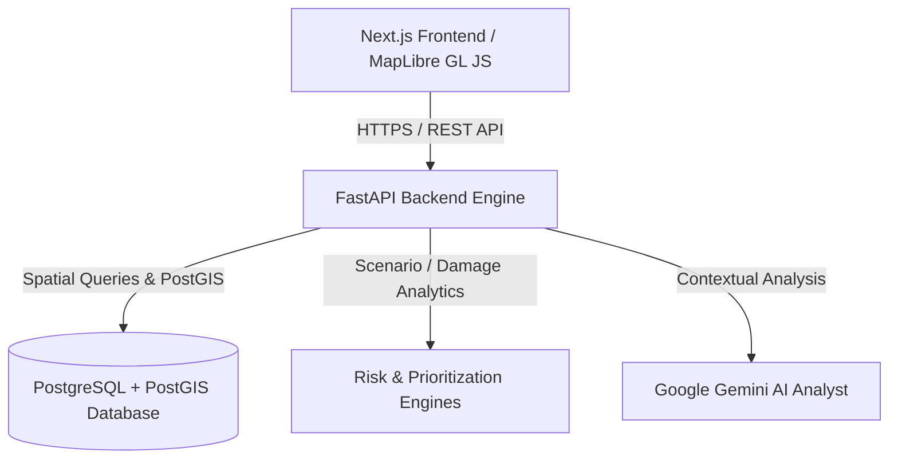

# AgriGuard-AI 🌾🛡️

> From farms to markets. From disasters to decisions.

AgriGuard-AI is an AI-powered geospatial food-system resilience platform that helps cities understand how disasters can disrupt agricultural production, wholesale markets, and urban food supply.

🔗 **Live Links:**
- [Live Demo (Landing Page)](https://agriguard-ai-frontend.onrender.com)
- [Command Center](https://agriguard-ai-frontend.onrender.com/command-center)
- [API Documentation](https://agriguard-ai-python-api.onrender.com/docs)

---

## 🚨 The Problem

A disaster does not stop at the farm.

When riverine flash floods or severe climate events strike agricultural regions, the impact cascades rapidly:

`Crop loss → Market disruption → Reduced food supply → Increased city risk → Recovery decisions`

Historically, agricultural land management, disaster response, market logistics, and municipal planning operate in silos. Cities often lack real-time geospatial intelligence connecting physical farm damage to urban food availability and recovery prioritization. AgriGuard-AI bridges these critical layers into a unified decision-support platform.

---

## 💡 The Solution

AgriGuard-AI models the entire food resilience chain:

```
Agricultural Land
       ↓
Disaster Exposure
       ↓
Spatial Impact Analysis
       ↓
Food-Supply Risk
       ↓
Recovery Priorities
       ↓
AI-Assisted Decision Support
```

By unifying PostGIS spatial analytics, multi-factor risk engines, and Gemini AI analysis, AgriGuard-AI answers five core civic questions during a crisis:
1. **What was affected?** Precise agricultural parcels and hectares inundated by flood events.
2. **How much food supply is at risk?** Quantitative metrics on crop production loss in metric tons.
3. **Which markets are exposed?** Primary wholesale hubs (APMCs) suffering supply-chain shortfalls.
4. **Where should recovery begin?** Algorithmic ranking of priority parcels for emergency agricultural assistance.
5. **Why is that location a priority?** Transparent, evidence-backed reasoning detailing flood depth, crop vulnerability, and market dependency.

---

## ✨ Key Capabilities

### 🗺️ Geospatial Food Network
Interactive mapping of agricultural parcels, wholesale market hubs, and supply vector connections built with PostGIS and MapLibre GL JS.

### 🌊 Disaster & Flood Simulation
Simulate flood scenarios with spatial intersection algorithms to identify affected agricultural land and depth exposure in real time.

### 📉 City Food-Supply Risk
Translate physical crop loss into city-level risk scores, classifying urban risk exposure across Moderate, High, and Critical thresholds.

### 🚨 Recovery Prioritization
Rank affected farm parcels using a deterministic multi-variable score considering:
- Flood inundation exposure
- Satellite-driven cultivation evidence
- Market dependency weights
- Crop economic vulnerability
- Estimated production loss

### 🤖 AI Decision Support
Integrated Gemini AI analyst providing natural-language policy briefs, key evidence summaries, and recommended civic actions based on live database queries.

### 🌐 Multilingual Intelligence
Full internationalization supporting English, Hindi (हिन्दी), and Marathi (मराठी) across all operational views.

### 🔐 Authentication & Security
Role-based access foundation with email/password authentication, Google OAuth integration, JWT session management, and client/server route protection.

---

## 🧪 Demonstration Scenario

> **Note on Data:** All current regional statistics are seeded prototype/demo datasets simulating realistic conditions for demonstration purposes. They do not represent real-time government statistics or official municipal mandates.

**Prototype Region:** Pune, Maharashtra, India

| Component | Prototype Data |
|---|---:|
| Agricultural parcels | 75 |
| Active cultivation parcels | 45 |
| Wholesale markets | 5 |
| Crops represented | 6 |
| Flood scenarios | 2 |

### Active Flood Example Result (Simulated Eastern Riverine Flash Flood):
- **12** affected agricultural parcels
- **2,119.3 metric tons** affected crop production
- **82.6 / 100** food-supply risk score (**CRITICAL** level)
- **11** critical recovery-priority parcels (e.g., `PARCEL-PNE-037`)

---

## 🧠 Architecture



---

## 🛠️ Technology Stack

- **Frontend:** Next.js (App Router), React, TypeScript, Tailwind CSS, MapLibre GL JS
- **Backend:** Python, FastAPI, Pydantic v2, Uvicorn, SQLAlchemy
- **Database:** PostgreSQL + PostGIS spatial extension
- **AI Integration:** Google Gemini API (Server-side)
- **Deployment:** Render Cloud Platform

---

## 📂 Project Structure

```
agri-guard-ai/
├── render.yaml             # Render multi-service deployment blueprint
├── docker-compose.yml      # Local PostgreSQL + PostGIS database container
├── .env.example            # Environment template
├── README.md               # Repository documentation
├── backend/                # FastAPI backend application
│   ├── app/
│   │   ├── api/            # REST endpoint routers (auth, risk, flood, food_system, ai)
│   │   ├── core/           # Configuration, database session, security, geospatial utils
│   │   ├── models/         # SQLAlchemy ORM database models
│   │   ├── schemas/        # Pydantic validation schemas
│   │   ├── services/       # Damage, risk, priority, and Gemini AI engines
│   │   └── main.py         # FastAPI application entrypoint
│   ├── seed.py             # Database table & seed initialization script
│   ├── tests/              # Pytest test suite
│   ├── requirements.txt    # Python dependencies
│   └── pytest.ini          # Pytest configuration
└── frontend/               # Next.js frontend application
    ├── src/
    │   ├── app/            # Next.js page routes (/, /auth, /command-center, /food-map, etc.)
    │   ├── components/     # UI components (MapView, RiskGauge, AppShell, Sidebar, etc.)
    │   ├── context/        # AuthContext & state providers
    │   └── lib/            # Typed API client & utilities
    ├── package.json        # Node dependencies & scripts
    ├── tsconfig.json       # TypeScript configuration
    └── tailwind.config.ts  # Tailwind CSS configuration
```

---

## 💻 Local Development

### Prerequisites
- **Node.js:** v18+ & npm
- **Python:** 3.10+
- **Docker:** Docker Desktop with Docker Compose

### 1. Environment Setup
Copy `.env.example` to `.env`:

Linux / macOS:
```bash
cp .env.example .env
```

Windows PowerShell:
```powershell
Copy-Item .env.example .env
```
> **Security Notice:** Never commit `.env` or secret API keys to version control.

### 2. Database Setup
Start the local PostGIS container:
```bash
docker-compose up -d
```

### 3. Backend Setup
```bash
cd backend
python -m venv venv

# Activate Virtual Environment:
# Windows PowerShell:
.\venv\Scripts\Activate.ps1
# Linux / macOS:
# source venv/bin/activate

pip install -r requirements.txt
python seed.py
uvicorn app.main:app --reload --port 8000
```
- Backend API: `http://localhost:8000`
- Swagger OpenAPI Docs: `http://localhost:8000/docs`

### 4. Frontend Setup
```bash
cd frontend
npm install
npm run dev
```
- Frontend Application: `http://localhost:3000`

---

## 🧪 Testing

### Backend Unit & Integration Tests (21 Tests)
```bash
cd backend
.\venv\Scripts\python.exe -m pytest
```

### Frontend Build & Type Check
```bash
cd frontend
npm run build
```

---

## 🚀 Production Deployment

AgriGuard-AI is deployed on the Render Cloud Platform using `render.yaml`:
- **PostgreSQL + PostGIS:** `agriguard-db`
- **FastAPI Backend:** [https://agriguard-ai-python-api.onrender.com](https://agriguard-ai-python-api.onrender.com)
- **Next.js Frontend:** [https://agriguard-ai-frontend.onrender.com](https://agriguard-ai-frontend.onrender.com)

---

## 🔮 Future Scope

- **Dynamic Farm & Market Registration:** Self-service administrative portals for regional farmers and market authorities.
- **User-Created Supply Networks:** Interactive node-graph tools for mapping private distributor logistics.
- **Multi-Region Expansion:** Extending spatial layers across additional agricultural districts in India.
- **Real-World Weather Feeds:** Integration with live satellite precipitation and river-gauge telemetry.
- **Multi-Hazard Modeling:** Extending beyond floods to drought, heatwave, and pest outbreak scenarios.
- **Role-Based Action Workflows:** Task assignment and relief fund disbursement routing for field officers.

---

## 🎥 Demo

**Core Workflow Execution:**
`Food Network → Flood Simulation → Spatial Impact → Food-Supply Risk → Recovery Priority → AI Decision Support`

*(Demo video walkthrough link placeholder)*

---

## 🏗️ BuildSprint 2026

AgriGuard-AI is being developed as part of LatentForce BuildSprint 2026.

---

## 👥 Team

Built with 💚 by the AgriGuard-AI Team.
